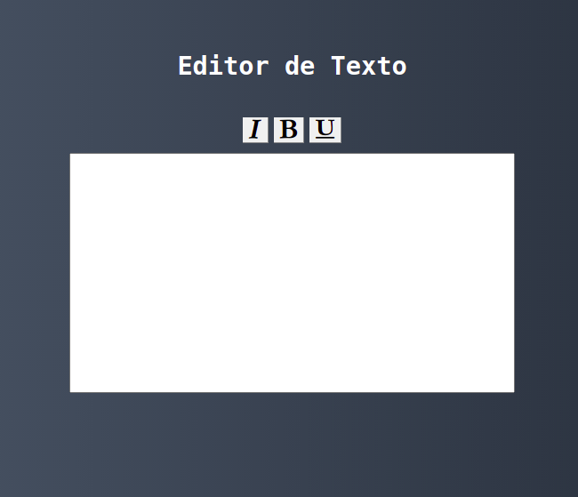

# Rich-Text

A small example of a rich-text application with only 3 methods, italic, bold and underlined

## About the Project



## Built With

React
Css
Html

## Prerequisites

* [React](https://reactjs.org/)

* [NodeJS](https://nodejs.org/en/download/)

### Installing

Clone the repo

```
https://github.com/matheusleal-code/rich-text_react.git
```

install NPM packages

```
npm install
```

## Built With

* [React](https://reactjs.org/) - The web framework used
* [Nodejs](https://nodejs.org/en/download/) - The web backend javascript 

## Authors

* **Matheus Leal**

## License

This project is licensed under the MIT License - see the [LICENSE.md](LICENSE.md) file for details
